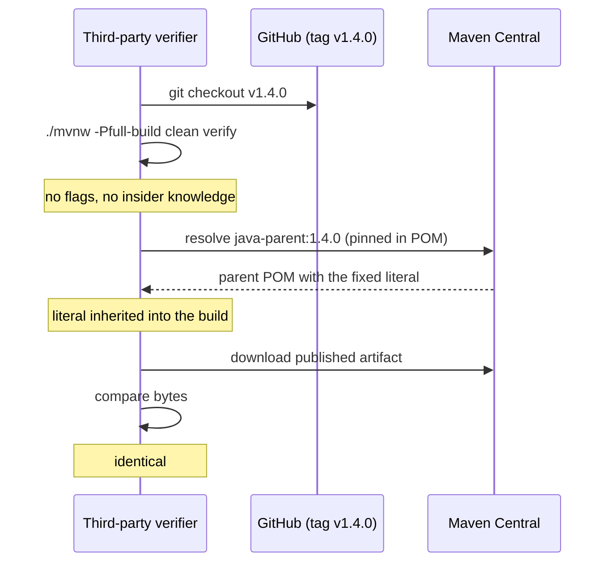
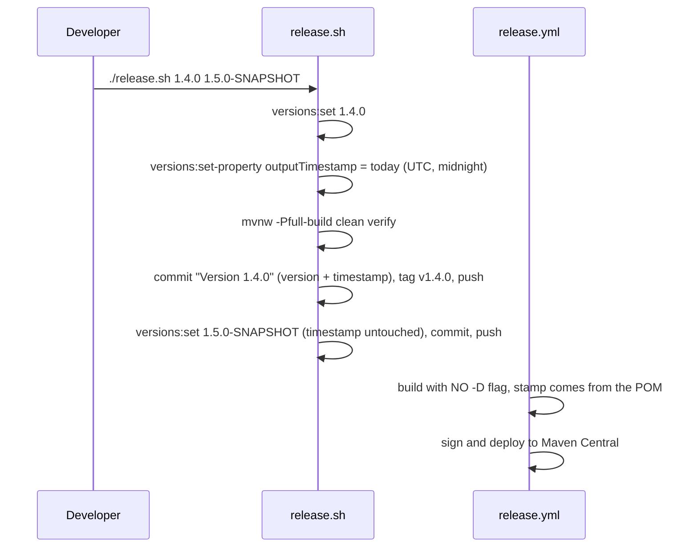

# Design: Reproducible build timestamp

## GitHub Issue

— (none yet; see [Follow-up: create the issue](#follow-up-create-the-issue))

## Summary

Every artifact built from `java-parent` currently embeds the wall-clock time of the
build. Two consecutive builds of the same source therefore produce different bytes.
Reproducibility exists today only inside Open Elements CI, because
`.github/workflows/release.yml` and `.github/workflows/snapshot.yml` pass
`-Dproject.build.outputTimestamp=$(git log -1 --format=%cI)` on the command line.
That flag is invisible to anyone outside the organisation, so a third party who
checks out a release tag and runs the documented build command cannot arrive at the
published bytes.

This change moves the timestamp from an invisible CI flag into a fixed literal in
the parent POM's `<properties>`. Child projects inherit it and set nothing. The
documented build command becomes sufficient on its own, which is what makes the
reproducibility claim externally verifiable. `release.sh` maintains the literal so
it does not silently rot.

## Goals

- A third party can rebuild any Open Elements Java artifact byte-identically from
  the published sources, using only the documented build command and no additional
  flags.
- Every project inheriting from `java-parent` gets this by upgrading the parent
  version — no per-project configuration.
- The maintained value cannot silently go stale: cutting a `java-parent` release
  updates it.
- The reproducibility claim in the README is narrow enough to be true.

## Non-goals

These are deliberately out of scope. Each has a corresponding entry in
[`docs/TODO.md`](../../TODO.md); the list here exists so the delivered scope is not
mistaken for a complete reproducibility guarantee.

- **Cross-toolchain reproducibility is not established.** The measurement backing
  this design compared two builds on one machine with one JDK patch version, one
  path, one locale and one timezone. Whether Temurin 21.0.5 and 21.0.9 produce the
  same Javadoc HTML is unknown and unmeasured. The README must therefore promise
  only *same source + same toolchain*, never *same source, any JDK 21*.
- **No automated verification.** No `verify-reproducible-build.sh`, no CI job. After
  the one-time manual acceptance run, the property's effect is unguarded — a future
  plugin upgrade could reintroduce non-determinism and nothing would notice.
- **No changes to consumer projects.** `spring-services` and `open-crm/backend` pin
  `java-parent` 1.2.1 and stay non-reproducible until someone upgrades them there.
  This spec prepares the parent; it does not roll anything out.
- **Snapshot builds are not reproducible, by decision.** A child pinning a
  `-SNAPSHOT` parent inherits a value that moves whenever the snapshot is
  republished. Accepted.
- **Not included:** `.gitattributes`/`.editorconfig` for line endings, enforcer rules
  forbidding SNAPSHOT/range dependencies in release builds, and
  `maven-artifact-plugin` buildinfo publishing.

## Measurements this design rests on

Both runs used a throwaway child project inheriting the local `java-parent`
`1.3.0-SNAPSHOT`, built with `-Pfull-build clean verify`.

**Is the property sufficient for the current plugin set?**

| Artifact | 2 builds, no timestamp pinned | 2 builds, timestamp pinned |
|---|---|---|
| `repro-probe-1.0.0.jar` | differs | byte-identical |
| `repro-probe-1.0.0-sources.jar` | differs | byte-identical |
| `repro-probe-1.0.0-javadoc.jar` | differs | byte-identical |
| `bom.json` | differs | byte-identical |
| `bom.xml` | differs | byte-identical |

The single property is sufficient. No extra `notimestamp` flag for
`maven-javadoc-plugin` and no `outputReproducible` flag for
`cyclonedx-maven-plugin` are required — CycloneDX 2.9.2 already binds its
`outputTimestamp` parameter to `${project.build.outputTimestamp}` by default
(parameter available since 2.7.9).

**Does inheritance work, and what wins?**

| Configuration | Resulting jar entry timestamp |
|---|---|
| Literal in **parent** `<properties>`, nothing in child | `2020-01-02 03:04` — inheritance works |
| Parent literal + CLI `-Dproject.build.outputTimestamp` | `2030-06-07 08:09` — **CLI wins** |
| Parent literal + child `<properties>` override | `2015-11-12 13:14` — **child wins** |

Precedence is `CLI -D` > child POM > parent POM. A parent-level literal is a real
default that anything downstream can override — which is precisely why the CLI
override in CI has to go.

## Technical approach

### 1. Fixed literal in the parent POM

Add to `<properties>` in `pom.xml`:

```xml
<!-- Reproducible builds: a fixed, deterministic timestamp for every archive entry
     and manifest. Inherited by all child projects, which set nothing themselves.
     Maintained by release.sh, which rewrites it on every release. -->
<project.build.outputTimestamp>2026-08-28T00:00:00Z</project.build.outputTimestamp>
```

**Rationale — why a literal in the parent rather than a CI-computed value.**
A value computed at build time is only knowable to whoever runs that build. External
verification requires the value to be part of the published source graph. The parent
POM is published to Maven Central and the child pins its parent version exactly, so a
verifier resolving `java-parent:1.4.0` gets bit-for-bit the same literal the release
used. This is also the approach the Maven reproducible-builds guide recommends.

**Rationale — why parent-level rather than per-project.**
Zero per-project configuration: a child becomes reproducible by upgrading its parent
version and nothing else. The cost is that every app shares the timestamp of the last
`java-parent` release, so the value describes *the parent release the app was built
against*, not the app's own build. Accepted deliberately (see
[Consequence: the timestamp is not a build time](#consequence-the-timestamp-is-not-a-build-time)).

**Format — date-granular, midnight UTC.** `YYYY-MM-DDT00:00:00Z`. Two releases on the
same day share a stamp, which is irrelevant for reproducibility. The coarser value is
easier to read and to reason about than a wall-clock second.

### 2. Remove the CLI override from both workflows

`.github/workflows/release.yml` and `.github/workflows/snapshot.yml` drop the
`BUILD_TS` computation and the `-Dproject.build.outputTimestamp="$BUILD_TS"` argument,
so CI runs exactly the command a third party runs.

Release build becomes:

```yaml
run: |
  ./mvnw -B -Pfull-build clean deploy \
    -DaltDeploymentRepository=local::file:./target/staging-deploy
```

This is the load-bearing part of the change. Leaving the flag in place would keep the
published artifacts stamped with the tag commit's committer date while an external
rebuild produced the inherited parent value — a guaranteed mismatch, and a
reproducibility claim that fails on first contact with a verifier.

### 3. `release.sh` maintains the value

When `release.sh` sets the release version, it also rewrites the timestamp property to
the release date, before the verification build so the released bytes and the tag
agree:

```bash
RELEASE_DATE=$(date -u +%Y-%m-%dT00:00:00Z)
./mvnw versions:set -DnewVersion="$NEW_VERSION"
./mvnw versions:set-property \
  -Dproperty=project.build.outputTimestamp \
  -DnewVersion="$RELEASE_DATE"
```

`versions-maven-plugin` is already managed in `<pluginManagement>` and already
configured with `generateBackupPoms=false`, so no new plugin is introduced.

The subsequent bump to the next `-SNAPSHOT` deliberately leaves the timestamp
untouched: snapshot builds between releases carry the previous release's date, which
is deterministic and consistent with snapshots not being a reproducibility target.

The script runs under `set -e`, so a failing `versions:set-property` aborts the
release rather than shipping a stale timestamp.

### 4. README documentation

Three additions, all constrained by what has actually been measured:

- A **Reproducible builds** section stating the narrow claim: the same source built
  with the same toolchain yields byte-identical artifacts, and how to verify it
  (check out the tag, run `./mvnw -Pfull-build clean verify`, compare).
- A note that passing `-Dproject.build.outputTimestamp` or overriding the property in
  a child POM defeats external verification.
- `Git-Commit-Time` documented as the deterministic answer to "when did this state
  come into being", replacing any `buildTime`-style field.

## Consequence: the timestamp is not a build time

`project.build.outputTimestamp` describes *the `java-parent` release an artifact was
built against*. It is not, and must not be presented as, the time this build ran. Any
`buildTime` / `build.time` field sourced from it would be misleading and must not be
introduced.

The honest, deterministic alternative already ships: the parent writes
`Git-Commit-Time` (UTC, commit-derived) into every jar manifest alongside
`Git-Commit`, `Git-Branch`, `Git-Tag` and `Git-Dirty`. Applications that want to
display "which state is this" use `Git-Commit-Time`.

Scope note: the `build-info.properties` concern that motivated this discussion
originates in `db-backup-service`, which inherits from `spring-boot-starter-parent`
and not from `java-parent`. Neither current `java-parent` consumer produces a build
info model, so no field is actually removed by this change.

## Key flows

### External verification — the flow this design exists to enable



### Release flow after the change



## Affected files

| File | Change |
|---|---|
| `pom.xml` | Add `project.build.outputTimestamp` to `<properties>` |
| `release.sh` | Rewrite the property to the release date at version bump |
| `.github/workflows/release.yml` | Remove `BUILD_TS` and the `-D` argument |
| `.github/workflows/snapshot.yml` | Remove `BUILD_TS` and the `-D` argument |
| `README.md` | Reproducible builds section, override warning, `Git-Commit-Time` |
| `docs/TODO.md` | New — records every deferred reproducibility topic |

## Dependencies

No new dependencies or plugins. `versions-maven-plugin` and
`cyclonedx-maven-plugin` are already managed in `<pluginManagement>`.

## Acceptance

There is no automated check, by decision. Acceptance is a **one-time manual
double-build before merge**, and it must use a throwaway child project — `java-parent`
has `packaging=pom` and produces only `bom.xml`/`bom.json` on its own, so a
double-build of the parent alone would exercise almost nothing.

1. `./mvnw -N install` the modified parent.
2. Create a throwaway child inheriting it, with one Java source file.
3. Build it twice with `-Pfull-build clean verify`, no flags.
4. Confirm jar, sources jar, javadoc jar, `bom.json` and `bom.xml` are byte-identical.
5. Record the result in the pull request description.

## Open questions

- **When does the first `java-parent` release carrying this ship?** Nothing is
  actually reproducible until a release exists and consumers upgrade to it.
- **What seed value goes in before the first release?** The design uses today's date
  (`2026-08-28T00:00:00Z`); `release.sh` overwrites it on the first release cut.

## Follow-up: create the issue

No GitHub issue exists yet. Suggested content for the user to create:

> **Title:** Make reproducible builds the default for all projects inheriting java-parent
>
> **Body:**
> Artifacts built from `java-parent` embed the wall-clock build time, so two builds of
> the same source differ. Measured on a probe child project: jar, sources jar, javadoc
> jar, `bom.json` and `bom.xml` all differ between two consecutive builds.
>
> Reproducibility currently exists only inside Open Elements CI, which passes
> `-Dproject.build.outputTimestamp` on the command line. That flag is invisible to
> outsiders, so a third party checking out a release tag cannot reproduce the
> published bytes.
>
> Move the timestamp into a fixed literal in the parent POM, inherited by all child
> projects, and maintain it from `release.sh`.
>
> **Acceptance criteria:**
> - `project.build.outputTimestamp` is a fixed literal in `pom.xml` `<properties>`
> - Both workflows build without any `-Dproject.build.outputTimestamp` argument
> - `release.sh` rewrites the property to the release date when bumping the version
> - A child project builds byte-identically twice with no extra flags
> - README documents the narrow claim and `Git-Commit-Time` as the build-time replacement
>
> Deferred items are tracked in `docs/TODO.md`.
