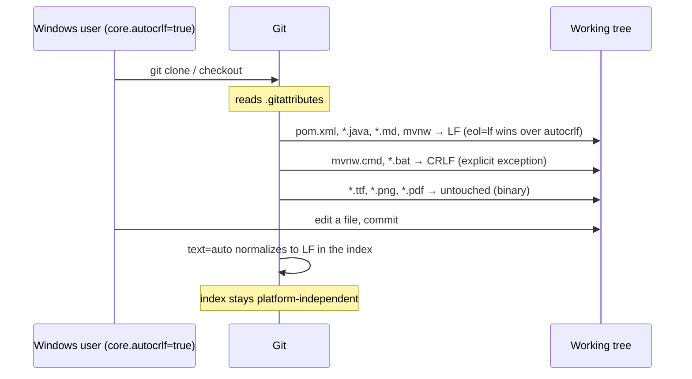

# Design: Pinned line endings

## GitHub Issue

— (none yet; see [Follow-up: create the issue](#follow-up-create-the-issue))

## Summary

The repository pins line endings nowhere: it has neither `.gitattributes` nor
`.editorconfig`. The bytes of every text file in a working tree therefore depend on
the Git configuration of whoever checked it out. On a default Windows installation
(`core.autocrlf=true`) every text file arrives with CRLF, which changes the contents
of any file the build reads or publishes.

This matters directly for `java-parent` itself, not only for its children.
`java-parent` has `packaging=pom` and no `flatten-maven-plugin`, so `pom.xml` is
deployed to Maven Central verbatim — a CRLF checkout produces a different published
`.pom` than an LF checkout. For child projects the same variance reaches the sources
jar and every copied resource.

This change adds a `.gitattributes` that forces LF in the working tree on every
platform, a matching `.editorconfig`, one inherited Spotless setting so child
projects cannot have CRLF written into their Java sources by the formatter, and a
README section that gives child projects a copy-paste block.

## Goals

- A checkout of this repository produces identical text-file bytes on macOS, Linux
  and Windows, regardless of the local `core.autocrlf` setting.
- Windows batch files remain valid for `cmd.exe`.
- `java-parent`'s own published `.pom` is not affected by the checkout platform.
- A child project that runs `spotless:apply` on Windows does not get CRLF written
  into its Java sources.
- The repository stops violating the Open Elements convention that every repository
  carries an `.editorconfig`.

## Non-goals

Each of the following has a corresponding entry in [`docs/TODO.md`](../../TODO.md).
The list exists so the delivered scope is not mistaken for a broader guarantee.

- **Cross-OS reproducibility is not claimed.** Line endings are one variance source
  among several; JDK-dependent Javadoc HTML, filesystem-dependent archive entry
  ordering and locale defaults are untouched here. Spec 001 restricts the
  reproducibility claim to *same source + same toolchain*, and this spec does not
  widen it. Eliminating line endings is a prerequisite for the broader claim, not
  the claim itself.
- **No automated verification.** No CI guard, and in particular no Windows CI job.
  See [Acceptance](#acceptance) for what this costs.
- **No enforcement reaching child repositories.** Git attributes are repository-local
  and Maven inheritance does not transport them. The Spotless setting is the only
  mechanically inherited part, and its reach is narrow (see
  [3. Spotless line endings](#3-spotless-line-endings-in-the-parent-pom)).
- **No change to the org-wide convention documents.** `.claude/skills/` here is a
  vendored copy of `claude-base`; editing it would create upstream drift. Recorded
  as a TODO instead.
- **`spotless:check` is not bound to a lifecycle phase.** Doing so would change the
  build contract for every child project and is a separate decision.

## Established facts this design rests on

Verified against the repository and the plugin descriptor before writing this design.

| Question | Finding |
|---|---|
| Does any tracked file carry CRLF in the index? | No. 159 files `i/lf`, 14 without line endings, 64 binary. `git add --renormalize .` is therefore a guaranteed no-op — no committed byte changes. |
| Does Git already detect the binary assets correctly? | Yes, all 64 (`.ttf`, `.png`, `.pdf`) are `i/-text`. Explicit `binary` markers are insurance for future file types, not a repair. |
| Is `mvnw.cmd` affected? | It is LF in the index and CRLF in the working tree today. Since Git always stores text files as LF in the index, `eol=crlf` changes only what is written on checkout — no commit diff. |
| Does `spotless-maven-plugin` 3.7.0 support the setting? | Yes. `lineEndings` is a documented parameter of type `com.diffplug.spotless.LineEnding`, and `UNIX` is a valid constant. |
| Is `pom.xml` published verbatim? | Yes — `packaging=pom`, no `flatten-maven-plugin` in the build. |

## Technical approach

### 1. `.gitattributes`

```gitattributes
# Line endings are pinned so a checkout produces the same bytes on every platform.
# Git always stores text files with LF in the index; `eol=lf` additionally forces LF
# in the working tree, overriding a local `core.autocrlf` (Windows default: true).
* text=auto eol=lf

# Windows batch files are the single exception: cmd.exe is fragile with LF-only
# scripts (labels, goto, multi-line blocks), so these are checked out as CRLF.
# The index representation stays LF, so this produces no commit diff.
*.bat text eol=crlf
*.cmd text eol=crlf

# Truly binary files: never normalized, never diffed as text.
*.class  binary
*.eot    binary
*.gif    binary
*.gz     binary
*.ico    binary
*.jar    binary
*.jks    binary
*.jpg    binary
*.jpeg   binary
*.p12    binary
*.pdf    binary
*.png    binary
*.ttf    binary
*.woff   binary
*.woff2  binary
*.zip    binary
```

**Rationale — baseline over allowlist.** An explicit per-extension allowlist leaves
everything unlisted ungoverned. In this repository that is concretely `mvnw` and
`.sdkmanrc` — both extensionless — plus every file type added in the future. The
`* text=auto` baseline is also the common denominator across the real-world
`.gitattributes` files surveyed (VS Code, BouncyCastle `bc-java`, `hiero-sdk-js`,
and Open Elements' own `decapbridge-api`).

**Rationale — `eol=lf`, not bare `text=auto`.** `text=auto` alone normalizes the
*index* only; on checkout the user's `core.autocrlf` still decides, so a Windows
default checkout still yields CRLF on disk. `eol=lf` is what makes the working tree
itself platform-independent. The cost is that Windows users see LF files, which
every current Windows editor handles.

**Rationale — explicit `binary` markers despite correct detection.** Git's heuristic
gets all 64 current assets right, so these lines fix nothing today. They remove the
dependency on the heuristic for future additions — keystores (`.p12`, `.jks`) and
archives being the classic cases where a misdetection would silently corrupt a file.
The list covers what is present plus the binary types a Java repository predictably
acquires.

**Renormalization.** `git add --renormalize .` is run once after adding the file, in
the same commit. As established above it is a no-op here; it is run so the working
tree and index are provably in agreement rather than assumed to be.

### 2. `.editorconfig`

The Open Elements standard from
`.claude/skills/project-setup/references/editorconfig.md`, with two deliberate
deviations:

- **`[*.java]` is corrected to match Google Java Format.** The org standard specifies
  `indent_size = 4` (globally) and `max_line_length = 120`. The parent enforces
  Spotless with `googleJavaFormat`, which formats with **2 spaces and 100 columns**.
  Copied verbatim, the standard would tell the IDE the opposite of what the next
  `spotless:apply` enforces — a developer types to the IDE's rule and the formatter
  rewrites it. The block becomes `indent_size = 2`, `ij_continuation_indent_size = 4`,
  `max_line_length = 100`. The remaining `ij_java_*` rules (no wildcard imports,
  braces always, `end_of_line` brace style) agree with Google Java Format and are
  kept unchanged.
- **`[*.{cmd,bat}] end_of_line = crlf` is added**, so the editor rule and the Git
  attribute agree. Without it, `[*] end_of_line = lf` would contradict the
  `eol=crlf` pin and an editor would fight the checkout.

This repository contains no Java file, so the corrected block has no local effect —
it is correct for the repository that defines the Java build for every child.

**Rationale — why deviate rather than follow the org document.** The conflict is not
specific to this repository: the standard `.editorconfig` is wrong for *every* Java
project that uses `googleJavaFormat`. Fixing it at the source belongs in
`claude-base`, which this spec cannot touch without creating upstream drift, so the
correction is applied here and the root cause is recorded as a TODO.

### 3. Spotless line endings in the parent POM

```xml
<plugin>
    <groupId>com.diffplug.spotless</groupId>
    <artifactId>spotless-maven-plugin</artifactId>
    <configuration>
        <!-- Spotless defaults to GIT_ATTRIBUTES, so on a child repository without a
             .gitattributes it writes whatever the local core.autocrlf implies — CRLF
             on a Windows default install. UNIX makes the formatter's output
             platform-independent for every inheriting project. -->
        <lineEndings>UNIX</lineEndings>
        <java>
            <googleJavaFormat/>
        </java>
    </configuration>
</plugin>
```

**Rationale — the only inheritable lever, and an honest account of its reach.** Git
attributes cannot be inherited through a parent POM. Spotless is configured in the
parent's `<build><plugins>` and therefore applies to every child. The setting is
narrow: Spotless has no lifecycle binding here, so it takes effect only when someone
runs `spotless:apply` or `spotless:check`, and it governs only the files Spotless
formats (currently Java). It does not make a child's sources jar LF-clean on its own
— that still requires the child to have its own `.gitattributes`. What it does
guarantee is that the formatter the parent mandates never *introduces* CRLF.

It also cannot be exercised in this repository, which has no Java sources; it first
takes effect in a child.

### 4. README section

A new section documenting:

- That this repository pins line endings, and why (the published `.pom` bytes).
- A copy-paste `.gitattributes` block for child projects, since nothing about the
  parent POM can deliver the file for them.
- That the parent forces `UNIX` line endings in Spotless, and what that does and
  does not cover.

**Rationale — documentation with known limits.** Of 26 sibling Open Elements
repositories, 8 have an `.editorconfig` despite it being a documented requirement,
and 1 has a `.gitattributes`. A README block is therefore not expected to be
self-enforcing; it is the reachable half of the change, with the org-wide fix
deferred to `claude-base`.

## Affected files

| File | Change |
|---|---|
| `.gitattributes` | New — baseline `* text=auto eol=lf`, CRLF for `*.bat`/`*.cmd`, explicit `binary` markers |
| `.editorconfig` | New — Open Elements standard with `[*.java]` corrected to Google Java Format and a `[*.{cmd,bat}]` block |
| `pom.xml` | Add `<lineEndings>UNIX</lineEndings>` to the Spotless configuration |
| `README.md` | New section: pinned line endings, copy-paste block for children |
| `docs/TODO.md` | Promote the "Line endings are not pinned" entry to this spec; add the two newly deferred items |

## Key flow: what changes for a Windows checkout



## Consequence: the Windows mechanism is measured, the Windows platform is not

`eol=lf` was chosen specifically for Windows, and no CI guard verifies it. The
decisive mechanism was however measured during implementation, by checking files out
of the index with the offending configurations forced on:

| Configuration forced | `crlf.java` | `probe.cmd` |
|---|---|---|
| `core.autocrlf=true` (Windows default) | LF | CRLF |
| `core.eol=crlf` | LF | CRLF |
| `core.autocrlf=false` | LF | CRLF |

The path-specific `eol` attribute wins in every case, which is the entire behaviour
the design depends on. Since Git's conversion logic is the same implementation on
every platform, this is stronger evidence than the specification alone.

What remains untested is the platform, not the mechanism: no build has run on a real
Windows machine, so editor behaviour, filesystem effects and the Git for Windows
installer defaults are unobserved. That residual gap is recorded in `docs/TODO.md`.

## Acceptance

There is no automated check, by decision. Acceptance before merge is:

1. `git ls-files --eol` shows no `i/crlf` and no `i/mixed`.
2. `git add --renormalize .` produces no staged changes.
3. `git check-attr text eol -- pom.xml mvnw mvnw.cmd .claude/skills/…/Lato-Regular.ttf`
   reports `eol=lf` for the first two, `eol=crlf` for `mvnw.cmd`, and `-text` for the
   font.
3a. Probe files confirm the conversion behaviour: a CRLF-authored `.java`, `.cmd`,
   `.md` and `.toml` all land as `i/lf` in the index; a file without line endings
   stays `i/none`; an explicitly marked `.p12` is stored byte-identical to disk.
4. `./mvnw clean verify` passes.
5. `./mvnw spotless:check` passes (no Java sources here, but the configuration must
   parse — an invalid `lineEndings` value fails the plugin).

## Open questions

- **When does a child project actually benefit?** As with spec 001, nothing changes
  downstream until a `java-parent` release carrying the Spotless setting exists and
  consumers upgrade to it.
- **Should `spotless:check` eventually be bound to the build?** Without a binding,
  the inherited setting only helps developers who invoke Spotless explicitly.
  Deliberately not decided here.

## Follow-up: create the issue

No GitHub issue exists yet. Suggested content for the user to create:

> **Title:** Pin line endings so a checkout produces the same bytes on every platform
>
> **Body:**
> The repository has neither `.gitattributes` nor `.editorconfig`, so the bytes of
> every text file depend on the checking-out user's Git configuration. On a default
> Windows install (`core.autocrlf=true`) all text files arrive with CRLF.
>
> This affects `java-parent` directly: with `packaging=pom` and no
> `flatten-maven-plugin`, `pom.xml` is deployed to Maven Central verbatim, so a CRLF
> checkout would publish different `.pom` bytes. For child projects the same variance
> reaches the sources jar and copied resources. It is also the variance source that
> spec 001 (reproducible build timestamp) leaves open.
>
> **Acceptance criteria:**
> - `.gitattributes` pins `* text=auto eol=lf`, with `*.bat`/`*.cmd` as `eol=crlf`
>   and explicit `binary` markers for asset types
> - `.editorconfig` follows the Open Elements standard, with `[*.java]` matching
>   Google Java Format (2 spaces, 100 columns) and a `[*.{cmd,bat}]` CRLF block
> - The parent's Spotless configuration sets `<lineEndings>UNIX</lineEndings>`
> - README documents the pin and offers a copy-paste block for child projects
> - `git add --renormalize .` produces no changes; `./mvnw clean verify` passes
>
> Cross-OS reproducibility is explicitly **not** claimed by this change; it remains
> tracked in `docs/TODO.md`.
