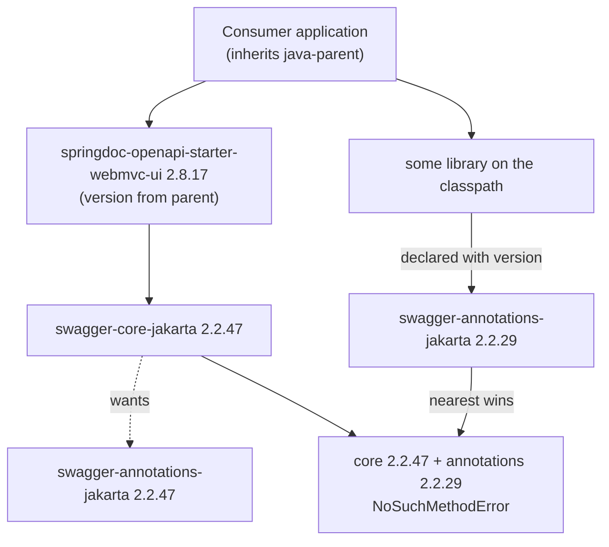

# Design: OpenAPI stack versions

## GitHub Issue

— (none yet; see [Follow-up: create the issue](#follow-up-create-the-issue))

## Summary

`java-parent` manages `springdoc-openapi-starter-webmvc-ui` 2.8.17 but manages none
of the Swagger artifacts springdoc is built against. Swagger therefore floats and is
resolved by Maven's nearest-wins mediation in every consuming project. When another
dependency contributes an older Swagger version, the result is not a uniformly old
stack but a **split** one — `swagger-core-jakarta` from springdoc, older
`swagger-annotations-jakarta` from the other dependency — and Swagger's own modules
then call each other across incompatible versions.

This was hit in a project consuming the parent: springdoc 2.8.17 could not be used
because a transitively contributed `swagger-annotations-jakarta` 2.2.29 produced a
`NoSuchMethodError`, forcing that project to pin springdoc back to 2.8.6.

The fix places the whole OpenAPI stack version under the parent's control: import
`springdoc-openapi-bom` and `swagger-bom`, manage `org.webjars:swagger-ui`
explicitly, and keep the three version properties in documented lockstep.

## Goals

- The parent's springdoc default works out of the box in every consuming project,
  without the consumer configuring anything.
- The Swagger stack is version-uniform: annotations, models and core always resolve
  to the same version.
- The OpenAPI stack version lives in one place in the parent.
- The lockstep rule between springdoc, Swagger and Swagger UI is discoverable at the
  point where someone would break it.

## Non-goals

- **No change to consuming projects.** They benefit by upgrading the parent version;
  nothing is rolled out here.
- **No enforcement of the lockstep.** It is a documented maintenance rule, not a
  mechanically checked one. See
  [Regression risk](#regression-risk) for what that costs.
- **No opinion on the javax/JAX-RS Swagger line.** `swagger-bom` pins it as a side
  effect; whether that is desirable is recorded in `docs/TODO.md`.
- **The springdoc version itself is not bumped or evaluated.** 2.8.17 stays.

## Reproduction

Observed in a Spring Boot service inheriting `java-parent`:

1. The application declares `springdoc-openapi-starter-webmvc-ui` without a version
   and inherits 2.8.17 from the parent.
2. Another dependency on the compile classpath (`spring-services-core`) contributes
   `swagger-annotations-jakarta` 2.2.29.
3. Springdoc contributes `swagger-core-jakarta` 2.2.47 transitively.
4. Schema resolution at startup or on first `/v3/api-docs` request throws
   `NoSuchMethodError`.

Workaround in place there: pin springdoc back to 2.8.6, whose matching Swagger
version *is* 2.2.29, restoring a uniform stack by accident rather than by design.

## Root cause analysis

### springdoc and Swagger are version-coupled

springdoc does not declare a Swagger version in the starter POMs. It inherits it from
its aggregator POM `org.springdoc:springdoc-openapi`, which carries:

| springdoc | `swagger-api.version` | `swagger-ui.version` |
|---|---|---|
| 2.8.6 | 2.2.29 | 5.20.1 |
| 2.8.17 | 2.2.47 | 5.32.2 |

Nothing published by springdoc exposes this coupling to a consumer:
`springdoc-openapi-bom` manages only the seven springdoc artifacts and deliberately
says nothing about Swagger.

### The failure is inside Swagger, not between springdoc and Swagger

Verified at bytecode level: springdoc 2.8.17's compiled classes reference **no**
Swagger member that is missing from 2.2.29. Springdoc is not the caller that fails.

The failing call is Swagger calling itself across a version boundary. In
`swagger-core-jakarta` 2.2.47:

```
io.swagger.v3.core.jackson.ModelResolver.resolve$dynamicRef(...)
  invokeinterface io/swagger/v3/oas/annotations/media/Schema.$dynamicRef:()Ljava/lang/String;
```

`$dynamicRef()` was added to the `@Schema` annotation in `swagger-annotations-jakarta`
2.2.47 and does not exist in 2.2.29. `AnnotationsUtils` in the same artifact contains
the same reference, and `ModelResolver` additionally calls
`io.swagger.v3.oas.models.media.Schema.$dynamicRef(String)`, likewise new in 2.2.47.

Between 2.2.29 and 2.2.47 the Swagger jakarta artifacts gained 89 public or protected
members and 8 classes, and lost 1. The three artifacts are released as a unit and are
only compatible with themselves.

### Why the split happens



A library that uses only the Swagger *annotations* declares only that artifact —
which is the normal thing to do. That declaration sits one level from the application
and wins mediation against `swagger-annotations-jakarta` 2.2.47, which springdoc
contributes two levels down through `swagger-core-jakarta`. `swagger-core-jakarta`
itself has no competitor and stays at 2.2.47. The stack splits along exactly the
artifact boundary that a well-behaved library would touch.

Pinning a single artifact would therefore not have been enough — the three must move
together.

### Why parent-level `dependencyManagement` is the right lever

`dependencyManagement` is consulted before mediation and applies at any depth, so a
managed version replaces whatever the graph would otherwise have resolved. Because it
is inherited from the parent, every consumer gets it without acting.

**The precise limit, which the fix does not overcome:** management overrides
*transitive* resolution only. A consumer that declares a Swagger artifact **directly
with an explicit `<version>`** still wins over the managed version. The fix therefore
resolves the case where a library contributes the old version, and does not resolve
the case where the application itself pins one. Consumers with their own hard pins
must drop them to benefit.

## Fix approach

### Properties

```xml
<!-- OpenAPI stack. These three versions are coupled and MUST be bumped together:
     springdoc is built against a specific Swagger and Swagger UI version, and mixing
     Swagger versions produces NoSuchMethodError inside Swagger itself.
     To find the matching values for a new springdoc release, open
     org/springdoc/springdoc-openapi/<version>/springdoc-openapi-<version>.pom
     and read <swagger-api.version> and <swagger-ui.version>. -->
<springdoc.version>2.8.17</springdoc.version>
<swagger.version>2.2.47</swagger.version>
<swagger-ui.version>5.32.2</swagger-ui.version>
```

### Dependency management

```xml
<dependency>
    <groupId>org.springdoc</groupId>
    <artifactId>springdoc-openapi-bom</artifactId>
    <version>${springdoc.version}</version>
    <type>pom</type>
    <scope>import</scope>
</dependency>
<dependency>
    <groupId>io.swagger.core.v3</groupId>
    <artifactId>swagger-bom</artifactId>
    <version>${swagger.version}</version>
    <type>pom</type>
    <scope>import</scope>
</dependency>
<!-- Not covered by either BOM: springdoc pulls the Swagger UI webjar transitively,
     and its version is part of the same coupled set. -->
<dependency>
    <groupId>org.webjars</groupId>
    <artifactId>swagger-ui</artifactId>
    <version>${swagger-ui.version}</version>
</dependency>
```

The existing explicit `springdoc-openapi-starter-webmvc-ui` entry is removed — the
BOM manages it at the same version, plus the webflux, scalar and common artifacts.

**Rationale — `swagger-bom` rather than three explicit pins.** Pinning
`swagger-annotations-jakarta`, `swagger-core-jakarta` and `swagger-models-jakarta`
individually would fix today's failure, but leaves an artifact list to maintain: if a
future springdoc pulls in `swagger-integration-jakarta`, the hand-written list
silently fails to cover it and the split-stack failure returns in a new place. The
BOM is published by the Swagger project, covers all 14 artifacts, and has no parent
POM of its own, so importing it drags nothing else in.

**Constraint discovered during implementation:** `swagger-bom` was first published at
**2.2.47** — every earlier version returns 404 on Maven Central, and the published
range is 2.2.47 through 2.2.55. The version this change needs is therefore the very
first one that has a BOM at all. Two consequences follow. A future springdoc release
pinned to a Swagger older than 2.2.47 could not use the import and would need the
three jakarta artifacts pinned individually. And a child overriding `swagger.version`
below 2.2.47 gets a hard model-building failure rather than an override — declaring
the artifact directly with a version remains available and unaffected.

**Rationale — importing `springdoc-openapi-bom` even though it does not fix the bug.**
It manages only springdoc's own artifacts and says nothing about Swagger, so it
contributes nothing to the failure at hand. It is imported because the parent
currently hand-manages exactly one springdoc artifact, and the BOM replaces that with
the vendor's own list — one fewer coordinate to maintain, and children can use the
webflux or scalar starters without a version.

**Rationale — not importing the `org.springdoc:springdoc-openapi` aggregator.**
Importing the aggregator POM instead would make the lockstep mechanical: one property
would pull springdoc, Swagger and the Swagger UI webjar in a guaranteed-consistent
set, removing the entire class of maintenance error described below. It was rejected
because that POM is springdoc's build aggregator, not a published integration
contract. The springdoc maintainers publish `springdoc-openapi-bom` as the contract
and deliberately scoped Swagger out of it; depending on the aggregator means
depending on internal build structure that may change between versions without notice.
It also manages `jjwt`, `scalar-*` and `therapi-*` and imports
`spring-cloud-function-dependencies`, all of which would then apply to every child.

**Rationale — managing `org.webjars:swagger-ui` directly.** No BOM covers it, and it
is part of the same coupled set. Its failure mode is milder than the split stack — a
Swagger UI whose JavaScript does not match the served OpenAPI document degrades the
documentation page rather than the service — but it floats for exactly the same
reason and costs one line to fix.

**Ordering note.** Within one `dependencyManagement` section the first declaration of
a coordinate wins, with imports expanded in place. No overlap exists today:
`spring-boot-dependencies` 3.5.14 manages no `io.swagger`, `org.springdoc` or
`org.webjars:swagger-ui` coordinate. Should that change, the position of these entries
relative to the Spring Boot import becomes significant.

### Documentation of the lockstep

The rule is written where someone would otherwise break it, in two places:

1. **A comment on the properties in `pom.xml`** (shown above), naming the exact file
   and properties to read for a new springdoc version.
2. **A maintenance section in `README.md`** describing the coupling, why mixing
   versions fails, and the same lookup path.

## Affected files

| File | Change |
|---|---|
| `pom.xml` | Add `swagger.version` and `swagger-ui.version` properties with the lockstep comment; import `springdoc-openapi-bom` and `swagger-bom`; manage `org.webjars:swagger-ui`; remove the explicit `springdoc-openapi-starter-webmvc-ui` entry |
| `README.md` | Document the managed OpenAPI stack and the lockstep maintenance rule |
| `docs/TODO.md` | Record the javax/JAX-RS side effect and the unenforced lockstep |

## Regression risk

- **A forgotten bump now breaks every child at once.** Today the parent pins springdoc
  and lets Swagger float, so a mismatch is a per-consumer accident. Afterwards the
  parent pins both, so bumping springdoc without bumping Swagger publishes the
  split stack to everyone inheriting the release. This is the direct cost of choosing
  a documented rule over the mechanical aggregator import, and is accepted
  deliberately.
- **Consumers move from Swagger 2.2.29 to 2.2.47.** A minor upgrade of a library some
  projects compiled against. The annotations are additive — 89 members added, 1
  protected method removed (`ModelResolver.addRequiredItem`, whose replacement is
  public) — so the practical risk is low, but affected libraries should be rebuilt
  and tested once against the managed version.
- **The javax and JAX-RS Swagger artifacts become managed for all children.**
  `swagger-bom` covers all 14 coordinates. A child using the non-jakarta line gets a
  version chosen for springdoc compatibility. Tracked in `docs/TODO.md`.
- **Children that hard-pin Swagger themselves are unaffected**, silently. Their direct
  declaration still wins, so they keep whatever they had and see no error and no fix.
  Measured on a probe child: a direct `swagger-annotations-jakarta` 2.2.29 declaration
  keeps the split stack even with the fix in place.
- **`swagger.version` has a floor of 2.2.47.** The BOM does not exist below that, so
  overriding the property downwards fails the build at model-building time with a
  non-resolvable import. The error is explicit rather than silent, but it is a new
  way for a child to break that did not exist before.

## Acceptance

`java-parent` has `packaging=pom` and no Java sources, so the fix cannot be exercised
by building the parent alone. Acceptance is a manual check against a throwaway probe
child, the same approach spec 001 used:

1. `./mvnw -N install` the modified parent.
2. Create a probe child inheriting it that declares
   `springdoc-openapi-starter-webmvc-ui` without a version, plus a dependency that
   transitively contributes `swagger-annotations-jakarta` 2.2.29.
3. `./mvnw dependency:tree -Dincludes=io.swagger.core.v3,org.webjars:swagger-ui`
   shows `swagger-annotations-jakarta`, `swagger-models-jakarta` and
   `swagger-core-jakarta` all at 2.2.47, and `swagger-ui` at 5.32.2.
4. Repeat against the unmodified parent to confirm the tree does show 2.2.29 there —
   otherwise the probe does not reproduce the problem and proves nothing.
5. Record both trees in the pull request description.

## Open questions

- **When do consumers benefit?** As with specs 001 and 002, not until a `java-parent`
  release carrying this exists and projects upgrade to it.
- **Should the downstream library drop its own Swagger pin?** Not required for
  consumers to be fixed, but it would remove the declaration that causes the
  mediation conflict in the first place. Out of scope here.

## Follow-up: create the issue

No GitHub issue exists yet. Suggested content for the user to create:

> **Title:** Manage the OpenAPI stack (springdoc, Swagger, Swagger UI) in dependencyManagement
>
> **Body:**
> The parent manages `springdoc-openapi-starter-webmvc-ui` 2.8.17 but none of the
> Swagger artifacts springdoc is built against, so Swagger floats and is resolved by
> nearest-wins in every consuming project.
>
> When a library contributes an older `swagger-annotations-jakarta`, the stack splits:
> `swagger-core-jakarta` 2.2.47 arrives via springdoc while the annotations stay at
> 2.2.29. `ModelResolver` in core 2.2.47 then calls
> `io.swagger.v3.oas.annotations.media.Schema.$dynamicRef()`, which does not exist in
> annotations 2.2.29 — a `NoSuchMethodError`. A consuming project hit exactly this and
> had to pin springdoc back to 2.8.6.
>
> springdoc's coupling is not exposed by anything it publishes:
> `springdoc-openapi-bom` manages only springdoc artifacts. The Swagger version lives
> in springdoc's aggregator POM as `<swagger-api.version>`.
>
> **Acceptance criteria:**
> - `pom.xml` imports `org.springdoc:springdoc-openapi-bom` and
>   `io.swagger.core.v3:swagger-bom`, and manages `org.webjars:swagger-ui`
> - `springdoc.version`, `swagger.version` and `swagger-ui.version` are documented as
>   a coupled set, with the lookup path for future bumps
> - The explicit `springdoc-openapi-starter-webmvc-ui` entry is removed in favour of
>   the BOM
> - A probe child that transitively receives `swagger-annotations-jakarta` 2.2.29
>   resolves all three jakarta artifacts to 2.2.47
> - README documents the managed stack and the lockstep rule
